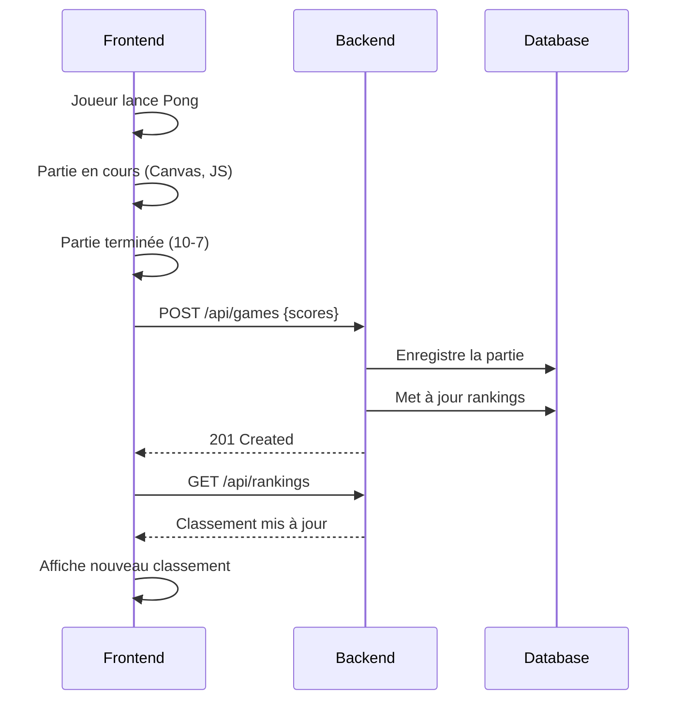

# 🎮 GameHub - Plateforme de Jeux Compétitifs en Ligne


---

## 📋 Description du Projet

**GameHub** est une plateforme web de jeux compétitifs permettant aux joueurs de s'affronter dans différents types de jeux (Pong, Snake, Chess, Poker, etc.), de suivre leurs performances via un système de classement, et d'interagir avec la communauté via des forums.

### 🎯 Besoins auxquels répond GameHub

| Besoin | Solution |
|--------|----------|
| **Compétition en ligne** | Système de parties multijoueurs avec enregistrement des scores |
| **Suivi des performances** | Classements (rankings) par type de jeu pour mesurer la progression |
| **Diversité des jeux** | Support de multiples types de jeux avec règles et scores différents |
| **Communication** | Forums thématiques et messagerie privée entre joueurs |
| **Historique** | Conservation complète de toutes les parties jouées |

---

## 🏗️ Architecture du Projet

```
gamesite/
├── backend/                    # API REST Spring Boot
│   ├── src/
│   │   └── main/
│   │       ├── java/com/gamesite/
│   │       │   ├── entity/           # Entités JPA
│   │       │   ├── dto/              # Data Transfer Objects
│   │       │   ├── repository/       # Repositories Spring Data
│   │       │   ├── service/          # Services métier
│   │       │   ├── controller/       # Contrôleurs REST
│   │       │   └── config/           # Configuration
│   │       └── resources/
│   │           └── application.properties
│   ├── pom.xml
│   └── mvnw / mvnw.cmd        # Maven Wrapper
├── frontend/                   # Application Angular (à venir)
├── doc/
│   ├── domain-model.md        # Modèle de domaine (DDD)
│   ├── api-documentation.md   # Documentation API
│   └── screenshots/
├── .gitignore
└── README.md
```

---

## 🚀 Technologies Utilisées

### Backend
- **Java 21** - Langage de programmation
- **Spring Boot 4.0.1** - Framework backend
- **Spring Data JPA** - Couche d'accès aux données
- **Spring Web MVC** - API REST
- **H2 Database** - Base de données en mémoire (développement)
- **PostgreSQL** - Base de données (production)
- **Lombok** - Réduction du code boilerplate
- **Swagger/OpenAPI 3** - Documentation API interactive

### Frontend (à venir)
- **Angular 17+** - Framework frontend
- **TypeScript** - Langage typé
- **RxJS** - Programmation réactive
- **Angular Material / Tailwind CSS** - UI/UX

---

## 📊 Modèle de Domaine (DDD)

### Entités Principales

#### 🧑 **Player** (Joueur)
Représente un utilisateur inscrit sur la plateforme.
- `username` : Pseudo unique
- `email` : Adresse email unique
- Relations : Participe à des `Games`, possède des `PlayerRankings`, écrit/reçoit des `Messages`

#### 🎮 **GameType** (Type de Jeu)
Catégorie de jeu (Chess, Poker, Pong, Snake, etc.)
- `name` : Nom unique du type de jeu
- Relations : Contient plusieurs `Games` et `PlayerRankings`

#### 🏆 **Game** (Partie)
Une partie jouée entre deux joueurs.
- `startTime` / `endTime` : Début et fin de la partie
- `scorePlayer1` / `scorePlayer2` : Scores des deux joueurs
- Relations : Oppose `player1` vs `player2`, appartient à un `GameType`

#### 📈 **PlayerRanking** (Classement)
Classement d'un joueur pour un type de jeu spécifique.
- `points` : Score total accumulé
- `dateAchieved` : Date d'obtention du classement
- Relations : Associe un `Player` à un `GameType`

#### 💬 **Forum**
Espace de discussion thématique.
- `name` : Nom du forum
- Relations : Contient plusieurs `Messages` publics

#### 📨 **Message**
Communication entre joueurs (publique ou privée).
- `message` : Contenu du message
- `date` : Date de création (auto-générée)
- Relations : A un `author` (obligatoire), un `receiver` (optionnel pour message privé), un `forum` (optionnel pour message public)

### Relations

```
Player ──1:N─→ PlayerRanking ──N:1─→ GameType
  │                                      │
  │                                      │
  └──────1:N─→ Game ←─N:1────────────────┘
              (player1, player2)

Forum ──1:N─→ Message ←─N:1── Player (author)
                       ←─N:1── Player (receiver, optionnel)
```

📖 **Documentation complète** : [doc/domain-model.md](doc/domain-model.md)

---

## 🔧 Installation et Configuration

### Prérequis
- **Java 21** ([Télécharger](https://adoptium.net/))
- **Node.js 18+** ([Télécharger](https://nodejs.org/))
- **Git** ([Télécharger](https://git-scm.com/))
- **IDE recommandé** : VSCode, IntelliJ IDEA ou Eclipse

### 1️⃣ Cloner le projet

```bash
git clone https://github.com/votre-username/gamesite.git
cd gamesite
```

### 2️⃣ Configuration Git (rebase par défaut)

```bash
git config --global pull.rebase true
```

### 3️⃣ Lancer le Backend

```bash
cd backend

# Windows
.\mvnw.cmd spring-boot:run

# Mac/Linux
./mvnw spring-boot:run
```

L'API sera accessible sur **http://localhost:8080**

### 4️⃣ Lancer le Frontend (à venir)

```bash
cd frontend
npm install
ng serve
```

L'application sera accessible sur **http://localhost:4200**

---

## 🌐 Documentation API (Swagger)

Une fois le backend lancé, accédez à la documentation interactive :

### 🔗 Swagger UI
```
http://localhost:8080/swagger-ui.html
```

Interface web interactive pour :
- ✅ Voir tous les endpoints disponibles
- ✅ Tester les requêtes directement
- ✅ Consulter les modèles de données
- ✅ Voir les exemples de réponses

### 📄 OpenAPI JSON
```
http://localhost:8080/api-docs
```

Spécification OpenAPI 3 au format JSON (pour génération de code client).

---

## 📡 Endpoints API Principaux

### Players (Joueurs)
| Méthode | Endpoint | Description |
|---------|----------|-------------|
| `GET` | `/api/players` | Liste tous les joueurs |
| `GET` | `/api/players/{id}` | Détails d'un joueur |
| `GET` | `/api/players/{id}/games` | Historique des parties d'un joueur |
| `GET` | `/api/players/{id}/rankings` | Classements d'un joueur |
| `POST` | `/api/players` | Créer un nouveau joueur |
| `PUT` | `/api/players/{id}` | Modifier un joueur |
| `DELETE` | `/api/players/{id}` | Supprimer un joueur |

### Games (Parties)
| Méthode | Endpoint | Description |
|---------|----------|-------------|
| `GET` | `/api/games` | Liste toutes les parties |
| `GET` | `/api/games/{id}` | Détails d'une partie |
| `GET` | `/api/games/player/{playerId}` | Parties d'un joueur |
| `GET` | `/api/games/game-type/{gameTypeId}` | Parties par type de jeu |
| `POST` | `/api/games` | Enregistrer une nouvelle partie |
| `PUT` | `/api/games/{id}` | Modifier une partie |
| `DELETE` | `/api/games/{id}` | Supprimer une partie |

### Rankings (Classements)
| Méthode | Endpoint | Description |
|---------|----------|-------------|
| `GET` | `/api/rankings` | Tous les classements |
| `GET` | `/api/rankings/{id}` | Un classement spécifique |
| `GET` | `/api/rankings/player/{playerId}` | Classements d'un joueur |
| `GET` | `/api/rankings/game-type/{gameTypeId}` | Top joueurs par jeu |
| `POST` | `/api/rankings` | Créer/mettre à jour un classement |

### Forums & Messages
| Méthode | Endpoint | Description |
|---------|----------|-------------|
| `GET` | `/api/forums` | Liste des forums |
| `GET` | `/api/forums/{id}/messages` | Messages d'un forum |
| `GET` | `/api/messages/author/{authorId}` | Messages par auteur |
| `GET` | `/api/messages/receiver/{receiverId}` | Messages privés reçus |
| `POST` | `/api/messages` | Poster un message |

📖 **Documentation complète** : Swagger UI

---

## 🗄️ Base de Données

### Développement (H2)
Base de données **en mémoire** (les données sont perdues au redémarrage).

**Console H2** : http://localhost:8080/h2-console
- **JDBC URL** : `jdbc:h2:mem:gamesitedb`
- **Username** : `sa`
- **Password** : (vide)

### Production (PostgreSQL)
Décommenter dans `application.properties` :
```properties
spring.datasource.url=jdbc:postgresql://localhost:5432/gamesitedb
spring.datasource.username=postgres
spring.datasource.password=votre_mot_de_passe
spring.jpa.database-platform=org.hibernate.dialect.PostgreSQLDialect
```

---

## 🧪 Tests de l'API

### Avec REST Client (VSCode)

Installer l'extension **REST Client**, puis créer un fichier `test-api.http` :

```http
### Créer un joueur
POST http://localhost:8080/api/players
Content-Type: application/json

{
  "username": "TestPlayer",
  "email": "test@example.com"
}

### Récupérer tous les joueurs
GET http://localhost:8080/api/players

### Créer un type de jeu
POST http://localhost:8080/api/game-types
Content-Type: application/json

{
  "name": "Chess"
}

### Enregistrer une partie
POST http://localhost:8080/api/games
Content-Type: application/json

{
  "player1Id": 1,
  "player2Id": 2,
  "gameTypeId": 1,
  "startTime": "2026-02-10T10:00:00Z",
  "endTime": "2026-02-10T11:00:00Z",
  "scorePlayer1": 1.0,
  "scorePlayer2": 0.0
}
```

### Avec cURL

```bash
# Créer un joueur
curl -X POST http://localhost:8080/api/players \
  -H "Content-Type: application/json" \
  -d '{"username":"TestPlayer","email":"test@example.com"}'

# Récupérer les joueurs
curl http://localhost:8080/api/players
```

---

## 🎮 Workflow Typique d'une Partie



---

## 👥 Répartition des Tâches

### Backend (Développeur 1)
✅ API REST Spring Boot
✅ Modèle de domaine (entités JPA)
✅ Services métier
✅ Documentation Swagger
✅ Base de données (H2/PostgreSQL)

### Frontend (Développeurs 2 & 3)
🔲 Développement des jeux (Pong, Snake, etc.) en Canvas/JS
🔲 Interface utilisateur (Angular)
🔲 Appels API REST
🔲 Gestion des pages (classements, profils, forums)
🔲 Design/UX

---

## ⚠️ Limitations et Améliorations Futures

### Limitations actuelles

**Sécurité**
- ❌ Pas d'authentification (Spring Security + JWT)
- ❌ Pas de gestion des rôles (USER, ADMIN)
- ❌ N'importe qui peut créer/modifier/supprimer des données

**Fonctionnalités**
- ❌ Pas de multijoueur en ligne temps réel (WebSockets)
- ❌ Pas de système de matchmaking automatique
- ❌ Pas de notifications en temps réel

### Justification

Ce projet est un **prototype académique**. Pour se concentrer sur :
1. L'architecture REST et la logique métier
2. La séparation frontend/backend
3. Les principes DDD (Domain-Driven Design)
4. La documentation et les bonnes pratiques

### Améliorations futures (v2)

| Amélioration | Technologie | Priorité |
|--------------|-------------|----------|
| Authentification JWT | Spring Security | 🔴 Haute |
| Tests unitaires | JUnit 5, Mockito | 🔴 Haute |
| WebSockets multijoueur | Spring WebSocket | 🟡 Moyenne |
| Système de notifications | Server-Sent Events | 🟡 Moyenne |
| Upload d'avatars | MinIO / AWS S3 | 🟢 Basse |
| Statistiques avancées | Spring Data + Charts | 🟢 Basse |

---

## 📚 Ressources et Références

### Documentation Technique
- [Spring Boot Documentation](https://docs.spring.io/spring-boot/)
- [Spring Data JPA](https://spring.io/projects/spring-data-jpa)
- [Swagger/OpenAPI](https://swagger.io/specification/)
- [Angular Documentation](https://angular.io/docs)

### Livres de Référence
- **Design Patterns: Elements of Reusable Object-Oriented Software** - Gang of Four (GoF)
- **Domain-Driven Design: Tackling Complexity in the Heart of Software** - Eric Evans

### Outils Utilisés
- [JDL Studio](https://start.jhipster.tech/jdl-studio/) - Modélisation des entités
- [Spring Initializr](https://start.spring.io/) - Génération du projet
- [dbdiagram.io](https://dbdiagram.io/) - Diagrammes de base de données

---

## 🤝 Contribution

### Workflow Git

```bash
# Récupérer les dernières modifications
git pull

# Créer une branche pour une nouvelle feature
git checkout -b feature/nom-de-la-feature

# Faire vos modifications
git add .
git commit -m "[FEAT] Description de la feature"

# Pousser la branche
git push origin feature/nom-de-la-feature
```

### Convention de Commits

```
[INIT]     - Initialisation du projet
[FEAT]     - Nouvelle fonctionnalité
[FIX]      - Correction de bug
[REFACTOR] - Refactoring du code
[DOC]      - Documentation
[TEST]     - Tests
[CONFIG]   - Configuration
```

---

## 📞 Contact

**Équipe GameHub**
- Backend Developer : [Votre nom]
- Frontend Developers : [Noms de tes copines]
- Email : contact@gamehub.com
- GitHub : [Lien du repository]

---

## 📄 Licence

Ce projet est réalisé dans le cadre d'un **projet académique** à [Nom de votre école/université].

---

## 🎉 Remerciements

Merci aux professeurs et à l'équipe pédagogique pour leur accompagnement sur ce projet.

---

<div align="center">
  <strong>Made with ❤️ by Team GameHub</strong>
</div>
</div>